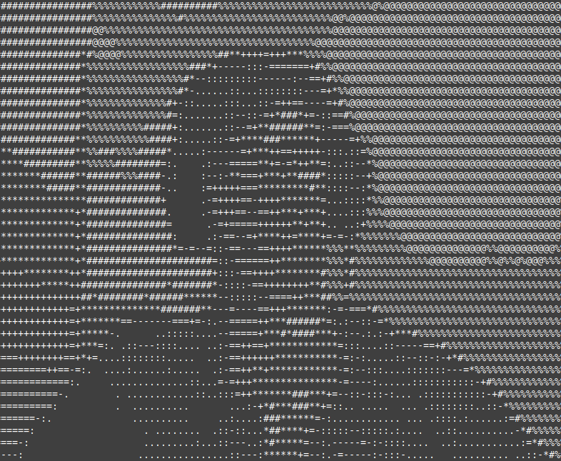

# WebcamASCII

Display your webcam in ASCII in your terminal

It's me in ASCII:


Inspired from: 
- https://github.com/uvipen/ASCII-generator
- https://github.com/micodeyt/ascii-webcam

## Requirements

- python 3
- openCV (cv2)

## Utilisation

Start:
```python
python3 main.py [row column -r -f]
```
Default:
```python
python3 main.py 48 128
```
Eg:
```python
python3 main.py 30 60 -f
```

row (integer): number of row (default: 48)

column (integer): number of column (default: 128)

-r: reverse black and white

-f: flip the output horizontaly

**Stop: ctrl+c**
